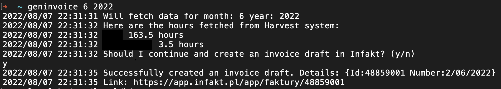

# Harvest -> Infakt invoicing tool

Small script/CLI tool that automates the billing process for me.

It basically does 2 things:
1. Fetches data from Harvest system (app in which I'm tracking my work time)
2. Creates draft of an invoice in Infakt (accounting system) based on Harvest data.

I'd probably code something like that in Python but decided that it will be a good opportunity to learn something new - hence `Golang` was chosen.

## Exemplary output
Here's an example of the console output generated by the app:


## Running app
To run the app:

```
go run .
```

or

```
make run
```

## Running tests
```
go test ./...
```

or

```
make test
```
